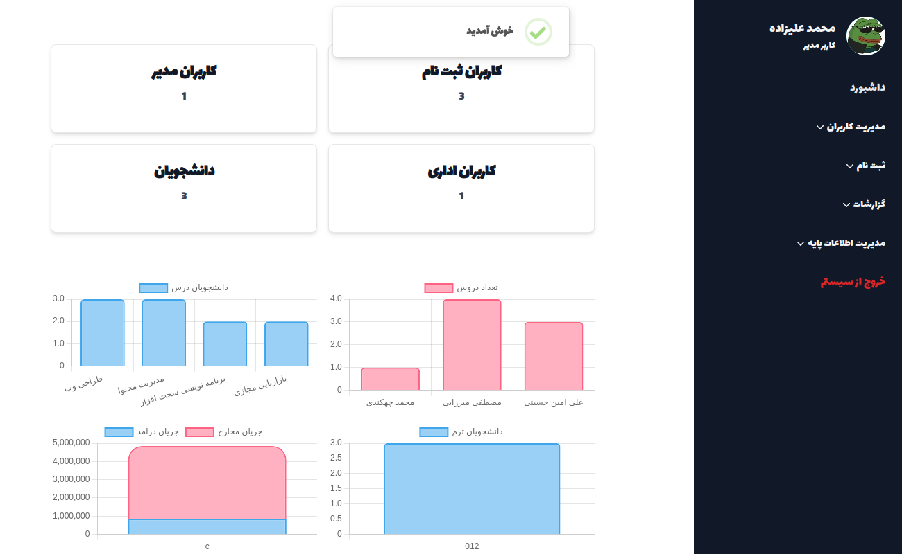
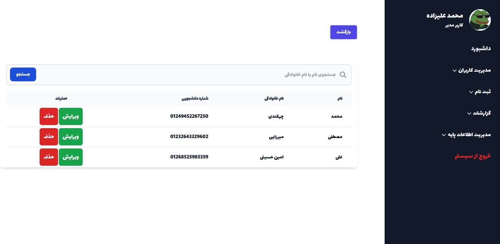
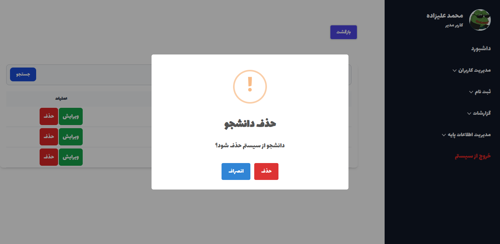

# University Registration System
this is my final year university project i did for about 2 month.i learned a lot during this project including laravel, blade template and database normalization.

## screenshots
login page

panel

students

delete student

## functionalities

 - **authentication**

	users can register and sign in with id and password

 - **employee**

	create, update and delete employees 

 - **student**

	create, update, delete student.
	enroll courses

 - **create lecturer**

	create, update, delete lecturer.

 - **create class**

	create where classes are being held

 - **create semester**

	create semester with year and code.

 - **create course**

	create courses for each lecturer.
	students can enroll them

 - **create bank**

	create bank and branch for payments.

 - **create discount**

	create discount for payments

 

 - **reports**

	chart stats on debts and cheques.

 - **roles**
 - 
	admin
	registration user
	office user
